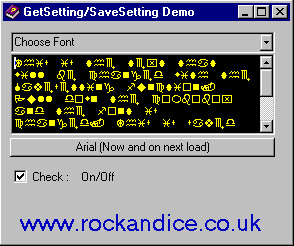



## Registry SaveSetting/GetSetting Demonstration for beginners

### Description

This is a fully commented working demo of the VB GetSetting and SaveSetting registry calls.

In other words hopefully an end to all the confusing code and comments that are currently available on this subject.

This code lets you save your specific program/exe/user settings in the registry and retrieve them as required.

Simple code, but fairly confusing for beginners.

Hope this helps a few of you out there.

Also covers loading a menu into a drop down combo box and shell a browser to a specific url.

Please vote for me if you like the prog :)
 
### More Info
 
Simly look at the code. It speaks for itself.

             |
---                |---
**Submitted On**   |2000-10-22 20:16:34
**By**             |[Rich Hogan](https://github.com/Planet-Source-Code/PSCIndex/blob/master/ByAuthor/rich-hogan.md)
**Level**          |Beginner
**User Rating**    |4.5 (18 globes from 4 users)
**Compatibility**  |VB 5\.0, VB 6\.0
**Category**       |[Registry](https://github.com/Planet-Source-Code/PSCIndex/blob/master/ByCategory/registry__1-36.md)
**World**          |[Visual Basic](https://github.com/Planet-Source-Code/PSCIndex/blob/master/ByWorld/visual-basic.md)
**Archive File**   |[CODE\_UPLOAD1089210232000\.zip](https://github.com/Planet-Source-Code/rich-hogan-registry-savesetting-getsetting-demonstration-for-beginners__1-12242/archive/master.zip)

